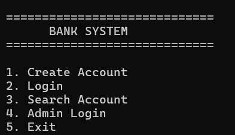
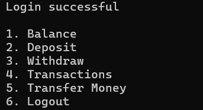
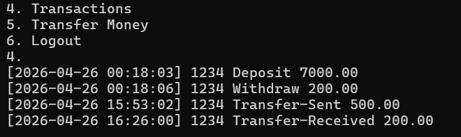

# C++ Banking System

## Overview
A command-line banking system built in C++ that demonstrates object-oriented programming, file handling, and persistent data storage across sessions.

## Features
- Account creation and login
- Secure authentication with masked PIN input
- Deposit and withdrawal operations
- Fund transfer between accounts
- Balance checking
- Transaction logging with timestamps
- Account lock after multiple failed login attempts
- Admin panel for account management and analytics
- Persistent data storage using files 

## Tech Stack
- C++
- OOP (Classes, Encapsulation)
- File Handling (ifstream, ofstream)

## Project Structure
- src/ → source files
- include/ → header files
- data/ → stored data files

## Data Storage
- Accounts stored in: data/accounts.txt
- Transactions stored in: data/transactions.txt

## How to Run

### Compile
g++ src/*.cpp -o bank

### Run
./bank

## Screenshots

### Main Menu

### User Dashboard

### Transactions (with timestamps)

## Demo Video

Watch the working demo here:  
https://drive.google.com/file/d/1O99_rDQM16g5ewu9Ui8-GpokbEdbc85p/view?usp=drive_link

## Author
Debopriya Das
